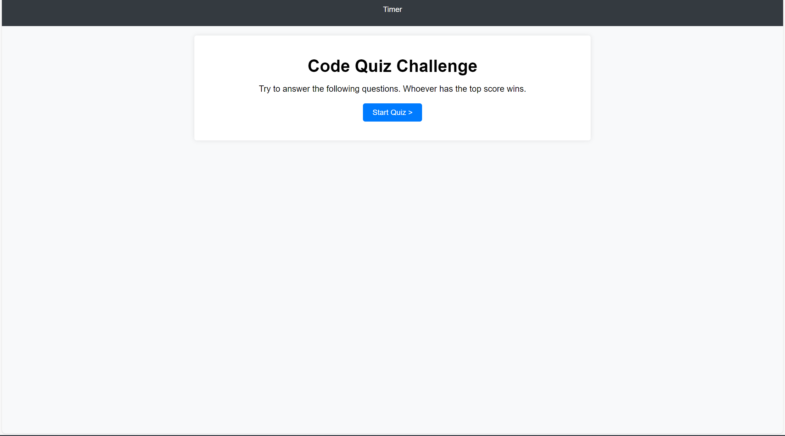

# Food-Quiz

## Description
    What we have here is an a food quiz javascript game using javascript and html. You will go through 4 questions and answer them but ofcourse the answers that i deemed correct will be correct. We simply click on the start quiz button and the quiz begins with the timer.

## Project Links
    - https://shawki45.github.io/Food-Quiz/
    - https://github.com/Shawki45/Food-Quiz.git

    

## Sources
    -tutors and zoom class meetings
    -https://www.youtube.com/watch?v=hdI2bqOjy3c&t=1622s
    -https://www.w3schools.com/
    -https://developer.mozilla.org/en-US/

## Screenshot

